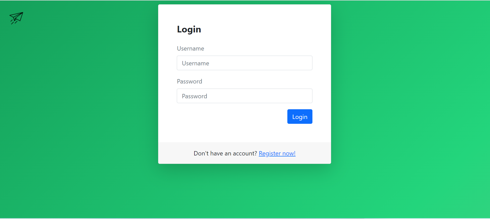
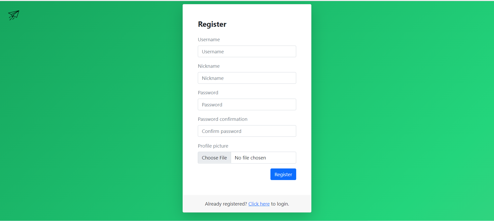
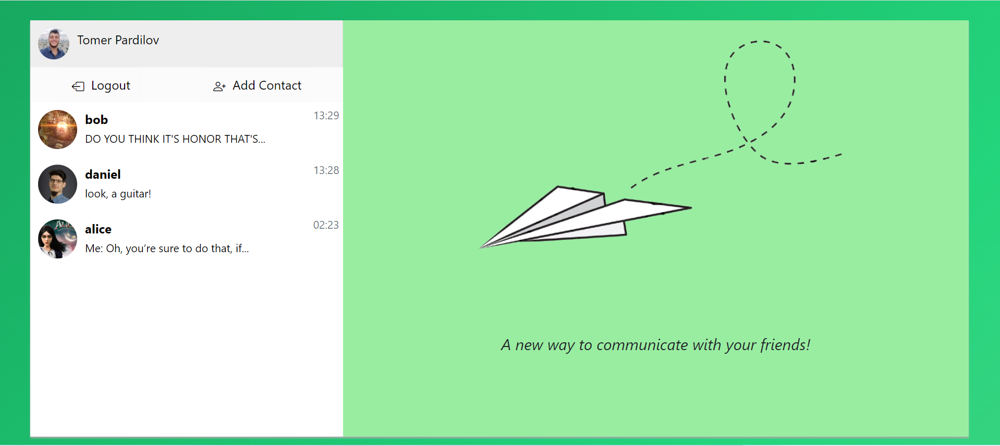

# Web Client Implementation - Chats App

## Requirments
As provided in package.json:
- React
- react-bootstrap
- react-router-dom
## General
- This is the first part out of four in the project for _Advanced Programming 2_ course at Bar Ilan University.
- This implementation has no data base at the present state, but instead uses **"Hard-coded" arrays** (Implemented using React contexts, and JSON objects).
- Authors: **Daniel Bronfman** (ID: 315901173) & **Tomer Pardilov** (ID: 316163922).

## Logic
We implemented **three main pages**:
- **Login page**: The user is asked to insert username and password, both are required.
- **Registration page**: The user is asked to insert username, nickname, password and image. All are required and are validated againt an alphanumeric pattern.
- **Chats page**: Here we can see user's contacts list and the conversations he has with them.

## Instructions for using the app
Use "npm start" script in node js to launch the code.
First, the user needs to input a valid username and password in the Login page. In case the user doesn't has an account he can register using the link provided at the bottom of the Login page.
### Valid, hard-coded credentials for logging in:
- alice: 12345
- bob: foo123
- tomer: 12345
- daniel: 12345
- peter: familyguy
### Register
Here the user needs to input his username, nickname, password and an image. These fields are mandatory, valid text format is in Alphanumericals only!
### Chats page
To test our app, it's recommended to login with "tomer" (password 12345). After successful login, you will see the welcome page (you can return back to login by clicking Logout button). Now, by clicking any chat in left side of the window - you will see the messages with your friends. Additionally, you can add contact by clicking the "Add Contact" button (from the current users that are registered to the application). To test the "Add Contact" feature it's recommended to login with any user except "tomer" because he is already connected with all users.

### Input Support
We support the following types of messages:
- **Text** messages.
- **Audio** messages.
- Current **location**. (Using "Mapbox" api)
- **Images** & **Videos**:
  - From file explorer.
  - As camera input.
## Technologies Used
In this part of the project we used multiple technologies, mainly **React, JavaScript, HTML & CSS**.
For styling we used **Bootstrap & React-Bootstrap**.

